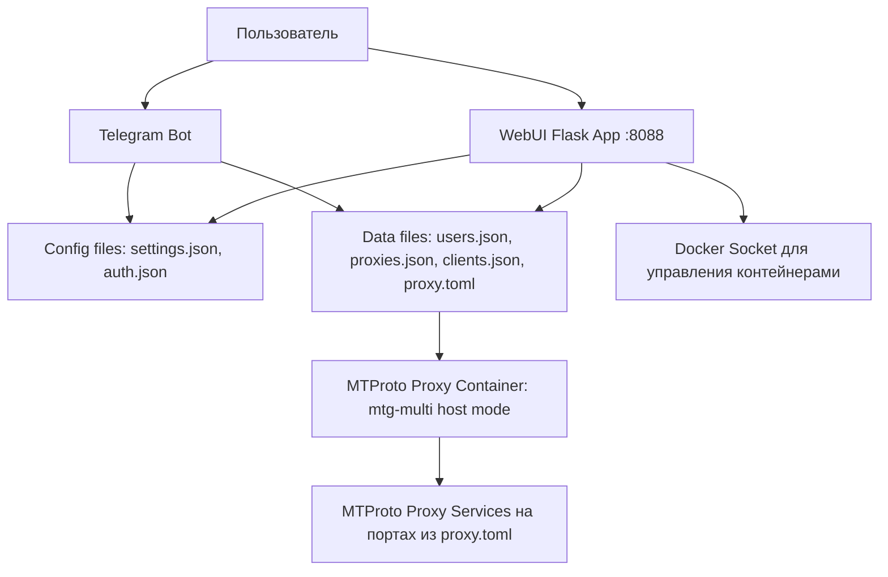

# MTProtoSERVER

MTProtoSERVER - это комплексное решение для развертывания и управления MTProto прокси-сервером на базе [mtg-multi](https://github.com/dolonet/mtg-multi). Проект включает веб-интерфейс для управления, Telegram бота для администрирования и автоматизированные инструменты для мониторинга и резервного копирования.

## Архитектура

Проект состоит из следующих компонентов:

- **MTProto Proxy**: Контейнер с mtg-multi для обработки MTProto трафика
- **WebUI**: Flask веб-приложение для управления сервером через браузер
- **Telegram Bot**: Бот для управления через Telegram
- **Agent**: Дополнительный компонент для мониторинга и автоматизации

Все компоненты запускаются через Docker Compose для обеспечения изоляции и простоты развертывания.



### Компоненты:
- **WebUI**: Flask приложение для управления сервером, обновляет proxy.toml для MTG.
- **MTProto Proxy**: Контейнер с mtg-multi в host network mode, слушает порты из proxy.toml.
- **Bot**: Telegram бот в контейнере для управления.
- **Config/Data**: JSON файлы для настроек, proxy.toml - динамический конфиг MTG.

## Требования к системе

- Docker и Docker Compose
- Минимум 1 ГБ оперативной памяти
- Linux сервер с публичным IP адресом
- Доступ к портам 1443 (MTProto), 8088 (WebUI)

## Установка

### 1. Клонирование репозитория с submodule

```bash
git clone --recursive https://github.com/your-repo/MTProtoSERVER.git
cd MTProtoSERVER
```

Если забыли `--recursive`, выполните:
```bash
git submodule update --init --recursive
```

### 2. Настройка конфигурации

Основные настройки находятся в файлах `config/settings.json` и `data/proxy.toml`.

**config/settings.json**:
- `proxy_ip`: Ваш публичный IP адрес
- `proxy_port`: Порт для MTProto (по умолчанию 1443)
- `webui_port`: Порт для веб-интерфейса (по умолчанию 8088)
- `bot_token`: Токен Telegram бота
- `admin_chat_id`: ID чата администратора в Telegram

**data/proxy.toml**:
- `bind-to`: Адрес и порт для привязки прокси
- `secrets`: Секреты для пользователей (генерируются автоматически)
- `fake_tls_domain`: Домен для маскировки TLS

### 3. Генерация секретов

Секреты для MTProto прокси генерируются с помощью локального mtg-multi:

```bash
docker-compose run --rm mtproto-proxy generate-secret --hex storage.googleapis.com
```

Или соберите образ и запустите:
```bash
docker build -t mtg-multi ./mtg-multi
docker run --rm mtg-multi generate-secret --hex storage.googleapis.com
```

Добавьте сгенерированные секреты в `data/proxy.toml` в раздел `[secrets]`.

## Запуск

### Запуск всех сервисов

```bash
docker-compose up --build -d
```

Флаг `--build` необходим для сборки образа mtg-multi из исходного кода.

### Проверка статуса

```bash
docker-compose ps
```

### Просмотр логов

```bash
# Логи всех сервисов
docker-compose logs -f

# Логи конкретного сервиса
docker-compose logs -f mtproto-proxy
docker-compose logs -f webui
docker-compose logs -f bot
```

## Использование

### Веб-интерфейс (WebUI)

После запуска откройте браузер и перейдите на `http://ваш-ip:8088`

**Функции WebUI:**
- **Dashboard**: Общая статистика и статус сервера
- **MTProto**: Управление прокси-серверами и пользователями
- **Clients**: Управление клиентами и их лимитами
- **Nodes**: Управление узлами сети
- **Settings**: Общие настройки сервера
- **Security**: Настройки безопасности и блокировок
- **Stats**: Детальная статистика использования
- **Logs**: Просмотр системных логов
- **Backup**: Резервное копирование и восстановление

**Вход в WebUI:**
- Логин: admin
- Пароль: указан в переменной `DASHBOARD_PASSWORD` в docker-compose.yml

### Telegram Bot

Бот предоставляет удобный интерфейс для управления сервером через Telegram.

**Основные команды:**
- `/start` - Запуск бота
- `/status` - Проверка статуса сервера
- `/users` - Управление пользователями
- `/proxies` - Управление прокси
- `/stats` - Статистика использования
- `/settings` - Настройки сервера

Бот доступен только администратору, ID которого указан в `ADMIN_CHAT_ID`.

### Управление прокси

#### Добавление нового пользователя

Через WebUI:
1. Перейдите в раздел "MTProto" > "Users"
2. Нажмите "Add User"
3. Укажите имя пользователя
4. Система автоматически сгенерирует секрет

Через Bot:
1. Отправьте команду `/users`
2. Выберите "Add User"
3. Следуйте инструкциям

#### Настройка лимитов

В `config/settings.json` можно настроить:
- `rate_limit`: Ограничение скорости (запросов в минуту)
- `geoblock_countries`: Блокировка по странам
- `ip_whitelist`/`ip_blacklist`: Белый/черный списки IP

## Конфигурация

### Переменные окружения

В `docker-compose.yml` определены следующие переменные:

- `PROXY_IP`: Публичный IP сервера
- `PROXY_COUNT`: Количество прокси-инстансов
- `DASHBOARD_PASSWORD`: Пароль для WebUI
- `BOT_TOKEN`: Токен Telegram бота
- `ADMIN_CHAT_ID`: ID администратора

### Автоматические функции

- **Auto-heal**: Автоматическое перезапуск сервисов при сбоях
- **Auto-update**: Автоматическое обновление компонентов
- **Backup**: Автоматическое резервное копирование данных

## Мониторинг и статистика

### API статистики

MTProto прокси предоставляет API для получения статистики:

```bash
curl http://localhost:9090/stats
```

Пример ответа:
```json
{
  "started_at": "2024-01-01T00:00:00Z",
  "uptime_seconds": 3600,
  "total_connections": 100,
  "users": {
    "user1": {
      "connections": 50,
      "bytes_in": 1048576,
      "bytes_out": 2097152,
      "last_seen": "2024-01-01T01:00:00Z"
    }
  }
}
```

### Логи

Логи всех компонентов собираются в Docker и доступны через:
```bash
docker-compose logs [service-name]
```

## Troubleshooting

### Проблемы с запуском

**Ошибка "Port already in use"**:
```bash
# Проверить занятые порты
netstat -tulpn | grep :1443
# Остановить конфликтующий сервис или изменить порт в настройках
```

**Ошибка с Docker**:
```bash
# Проверить статус Docker
sudo systemctl status docker
# Перезапустить Docker
sudo systemctl restart docker
```

### Проблемы с подключением

**Клиенты не могут подключиться**:
- Проверьте, что порт 1443 открыт в firewall
- Убедитесь, что публичный IP указан правильно
- Проверьте логи mtproto-proxy

**WebUI недоступен**:
- Проверьте порт 8088
- Убедитесь, что контейнер webui запущен
- Проверьте логи webui

### Проблемы с ботом

**Бот не отвечает**:
- Проверьте токен бота в настройках
- Убедитесь, что ADMIN_CHAT_ID указан правильно
- Проверьте логи bot

## Безопасность

- Используйте сильные пароли для WebUI
- Ограничьте доступ к портам только необходимыми
- Регулярно обновляйте компоненты
- Мониторьте логи на подозрительную активность
- Используйте геоблокировку для ограничения доступа

## Резервное копирование

Проект поддерживает автоматическое резервное копирование:
- Настраивается в `config/settings.json`
- `backup_enabled`: Включить/выключить
- `backup_interval`: Интервал (hourly/daily/weekly)
- Резервные копии хранятся в папке `backups/`

### Ручное резервное копирование

```bash
docker-compose exec webui python backup.py
```

## Обновление

### Обновление компонентов

```bash
# Остановить сервисы
docker-compose down

# Обновить образы
docker-compose pull

# Запустить обновленные сервисы
docker-compose up -d
```

### Обновление конфигурации

После изменения конфигурационных файлов перезапустите сервисы:

```bash
docker-compose restart
```

## Поддержка

При возникновении проблем:
1. Проверьте логи через `docker-compose logs`
2. Убедитесь, что все требования выполнены
3. Проверьте настройки в конфигурационных файлах
4. Создайте issue в репозитории проекта

## Лицензия

Этот проект распространяется под лицензией MIT. Подробности в файле LICENSE.