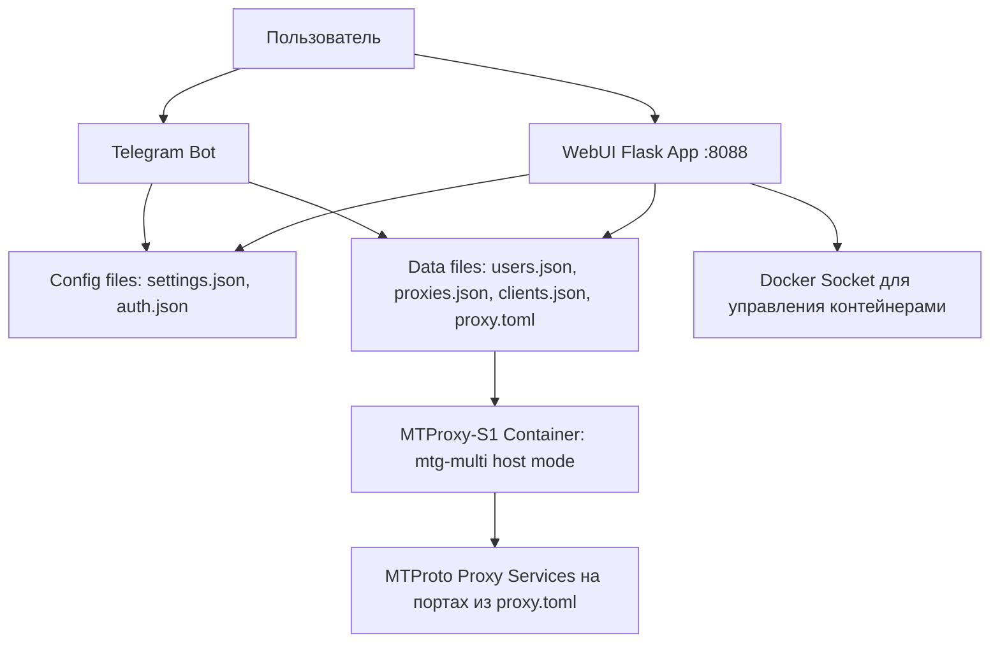

## Архитектура MTProtoSERVER

### Компоненты:
- **WebUI**: Flask приложение для управления сервером, обновляет proxy.toml для MTG.
- **MTProxy-S1**: Контейнер с mtg-multi в host network mode, слушает порты из proxy.toml.
- **Bot**: Telegram бот в контейнере для управления.
- **Config/Data**: JSON файлы для настроек, proxy.toml - динамический конфиг MTG.

### Изменения:
- MTG слушает несколько портов из bind-to списка.
- Secrets: все секреты (base proxy + clients) в одном конфиге.
- Поддержка произвольных портов через host networking.