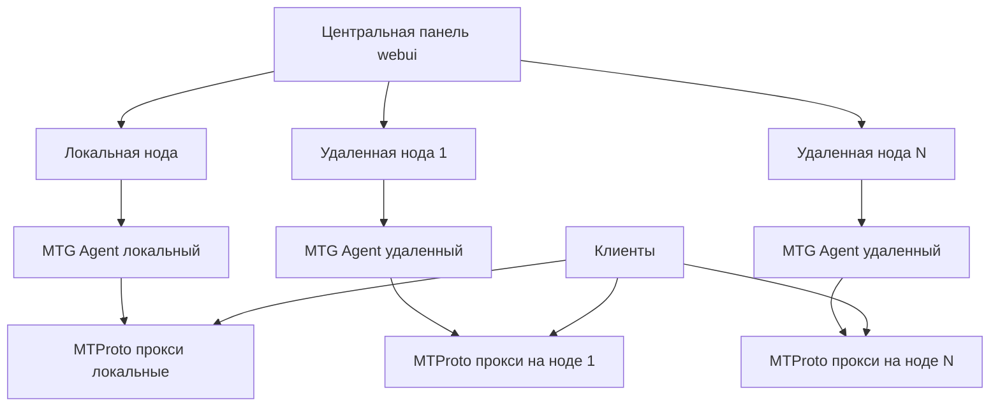

# План реализации распределенной архитектуры MTProtoSERVER с нодами

## Архитектура

## Компоненты
- **Центральная панель**: Управление нодами, прокси, клиентами. Отправляет команды на агенты.
- **MTG Agent**: Сервис на каждой ноде для мониторинга и управления прокси через Docker API.
- **Ноды**: Серверы с установленным агентом и Docker.
- **Прокси**: Контейнеры mtg-multi, запущенные на нодах.

## Основные изменения
1. **Агент**: Добавить API для создания/управления прокси.
2. **Панель**: Добавить выбор ноды при создании прокси, логику отправки команд на агенты.
3. **Мониторинг**: Сбор статистики с агентов для прокси на нодах.
4. **Хранение**: Расширение proxies.json для node_id.

## Todo
- Расширить API агента: добавить POST /proxies для создания MTProto прокси на ноде (параметры: port, domain, secret, label)
- Добавить в агент функции для запуска/остановки контейнеров mtg-multi через Docker API
- Обновить структуру proxies.json: добавить поле node_id для привязки прокси к ноде
- Изменить /api/mtproto/create в webui/app.py: добавить логику выбора ноды и отправки запроса на агент
- Обновить интерфейс mtproto.html: добавить select для выбора ноды при создании прокси
- Изменить сбор статистики: для прокси с node_id запрашивать данные у агента ноды
- Добавить в агент эндпоинты для управления прокси: PUT /proxies/{name} (обновить), DELETE /proxies/{name} (остановить)
- Обновить панель: добавить кнопки управления прокси на нодах (перезапуск, удаление)
- Протестировать создание прокси на локальной и удаленной нодах
- Обновить документацию в nodes.html с инструкциями по управлению прокси на нодах