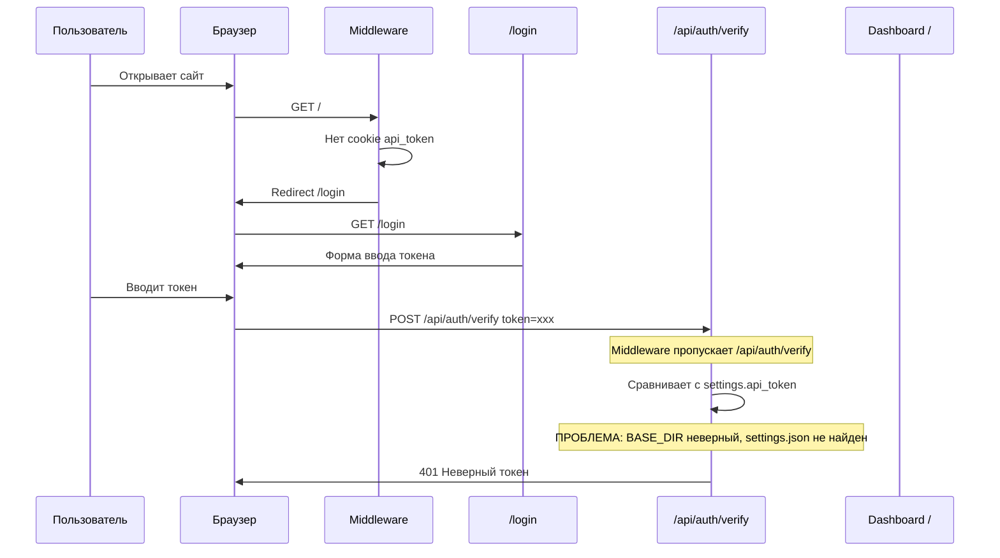

# План исправления и оптимизации MTProtoSERVER

## Анализ найденных проблем

### 🔴 КРИТИЧЕСКАЯ ПРОБЛЕМА: Авторизация не работает

**Корневая причина:** В `install.sh` (строка 595-596) генерируется API токен через `openssl rand -hex 32` и записывается в `settings.json`. Однако в `settings.json` значение `bot_enabled` записывается как `${BOT_ENABLED}` — это bash-переменная со значением `yes`/`no` (строка), а не `true`/`false` (JSON boolean). Это может ломать парсинг JSON.

**Но главная проблема авторизации:**

1. **Двойная система авторизации конфликтует:**
   - `auth_middleware` (строка 21-50 в `app.py`) проверяет токен из **cookie** `api_token`
   - API endpoints используют `dependencies=[Depends(verify_api_token)]` который проверяет **Bearer header**
   - При запросе из веб-формы: middleware пропускает (cookie есть), но `verify_api_token` падает (нет Bearer header) → 401

2. **Путь к `settings.json` неверный в Docker:**
   - `BASE_DIR = os.path.dirname(os.path.dirname(__file__))` — в Docker это `/app/..` = `/`
   - Docker volume монтирует `./config:/app/config` и `./data:/app/data`
   - Но код ищет `/../config/settings.json` = `/config/settings.json` — это неверно!
   - Правильный путь: `/app/config/settings.json`

3. **Endpoint `/generate_api_token` отсутствует** — в `app.js` (строка 48) вызывается `POST /generate_api_token`, но такого endpoint нет в `app.py`

4. **`/api/auth/verify` не устанавливает cookie** — он только проверяет токен и возвращает JSON. Cookie устанавливается на клиенте через JS, что работает, но при redirect на `/` middleware снова проверяет cookie.

### Схема текущего потока авторизации (сломанного):

## План исправлений

### 1. Исправить пути к файлам конфигурации
- Заменить `BASE_DIR = os.path.dirname(os.path.dirname(__file__))` на определение через env или `/app`
- Использовать `/app/data` и `/app/config` как пути по умолчанию в Docker

### 2. Исправить систему авторизации
- Убрать `dependencies=[Depends(verify_api_token)]` с API endpoints для веб-форм
- Middleware уже проверяет cookie — этого достаточно для веб-интерфейса
- Для внешнего API использовать Bearer token через отдельную проверку
- Сделать `/api/auth/verify` устанавливающим cookie через `response.set_cookie()`

### 3. Добавить отсутствующий endpoint `/generate_api_token`
- POST `/generate_api_token` — генерирует новый токен, сохраняет в settings.json

### 4. Добавить REST API для внешних клиентов
- `POST /api/v1/clients` — добавление клиента с expires через Bearer token
- `GET /api/v1/clients` — список клиентов
- `DELETE /api/v1/clients/{id}` — удаление клиента

### 5. Исправить install.sh
- `bot_enabled` должен быть `true`/`false`, а не `yes`/`no`

### 6. Улучшить веб-кабинет
- Показывать expires в таблице пользователей
- Исправить стили login.html под тему проекта
- Добавить валидацию форм
- Исправить `created_at: 'now'` на реальную дату

### 7. Добавить автоматическую проверку expired пользователей
- Использовать BackgroundTasks или asyncio scheduler в FastAPI

### 8. Общие улучшения кода
- Заменить bare `except:` на конкретные исключения
- Добавить logout endpoint
